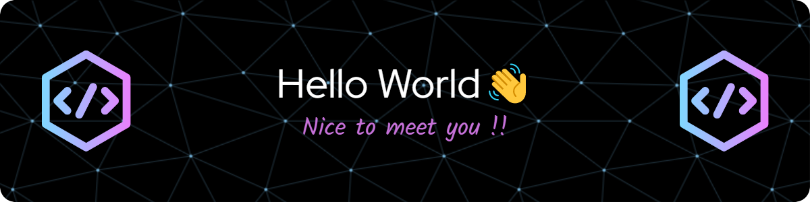

<!--
**tomar619/tomar619** is a ✨ _special_ ✨ repository because its `README.md` (this file) appears on your GitHub profile.
-->

# 💫 About Me:

- 🔭 I’m currently working on with TCS as a consultant for Scandinavian Airlines(SAS)
- 🌱 I’m currently learning more about Modern web development
- 👯 I’m looking to collaborate on Open API
- 🤔 I’m looking for help with DSA
- 💬 Ask me about Airline operations
- 📫 How to reach me: Email- amittomar619@gmail.com
- 😄 Pronouns: He/his
- ⚡ Fun fact: I'm huge football fan

## 🌐 Socials:
   

## 💻 Tech Stack:
<h3 align="left">Languages and Tools:</h3>

                           

## 📊 GitHub Stats:
<!--
 
 

-->

	

<!--

  
  

 

-->
  

## My Latest Blog Posts📖

## 🏆 GitHub Trophies

### ✍️ Dev Quote

### 😂 Here's a Dev Joke for you
<!--   -->

  ## 💰 Show your support
   

<!-- Proudly created with GPRM ( https://gprm.itsvg.in ) -->
